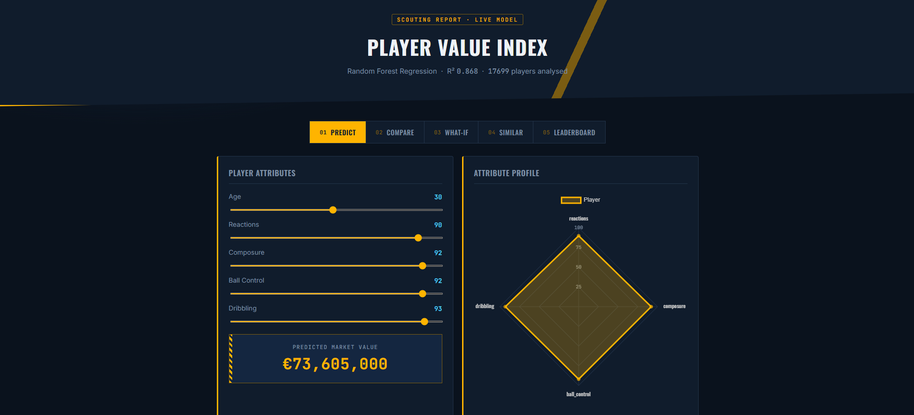
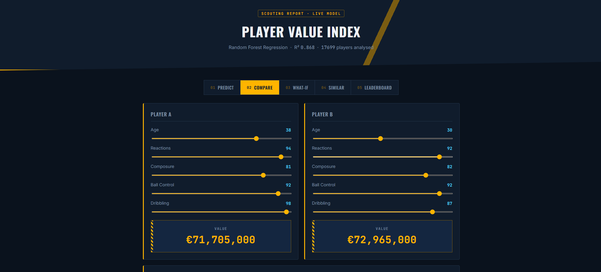
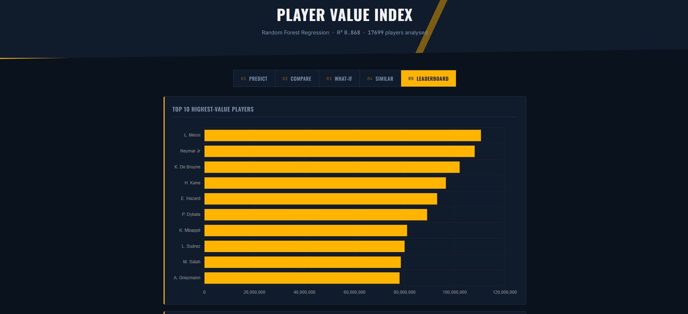

# ⚽ Player Value Predictor

A machine learning project that predicts a football player's market value based on their attributes (age, reactions, composure, ball control, dribbling), paired with a full-stack web app for interactive predictions.

Originally built as an AI project, later rebuilt into a complete, deployable application with a Flask API backend and a custom HTML/CSS/JS frontend.

---

## 🎯 Features

- **Live Prediction** — enter a player's attributes and get a predicted market value instantly
- **Player Comparison** — compare two players side-by-side with an overlapping radar chart
- **What-If Analysis** — see how changing a single attribute affects predicted value
- **Similar Players Finder** — find real players from the dataset with the closest attribute profile
- **Leaderboard** — top 10 highest-value players and value trends by age

---

## 📊 Model Performance

Three models were trained and compared on the dataset:

| Metric | Linear Regression | Random Forest |
|---|---|---|
| MAE | 2,421,429 | 874,521 |
| RMSE | 4,659,351 | 2,090,618 |
| **R² Score** | 0.345 | **0.868** |

**Random Forest** was selected as the final model — it captures the non-linear relationship between player attributes and market value far better than a linear model.

Feature importance showed **`reactions`** as by far the strongest predictor of a player's value, followed by ball control and technical skill.

---

## 🛠️ Tech Stack

- **Data analysis & modeling**: Python, pandas, scikit-learn (Random Forest, Linear Regression, MLP Neural Network), seaborn/matplotlib
- **Backend**: Flask (serves the trained model as a JSON API)
- **Frontend**: HTML, CSS, JavaScript, Chart.js

---

## 📁 Project Structure

```
player-value-predictor/
├── PlayerStats.ipynb     # Original data analysis & model training notebook
├── webapp/
│   ├── server.py             # Flask backend + API endpoints
│   ├── templates/
│   │   └── index.html
│   └── static/
│       ├── style.css
│       └── script.js
└── README.md
```

---

## 🚀 Getting Started

### 1. Clone the repository
```bash
git clone https://github.com/BaseerAhmed-1/Player-Value-Predictor.git
cd Player-Value-Predictor
```

### 2. Set up a virtual environment
```bash
python -m venv venv
venv\Scripts\activate      # Windows
# source venv/bin/activate # macOS/Linux
```

### 3. Install dependencies
```bash
pip install pandas seaborn matplotlib numpy scikit-learn flask jupyter
```

### 4. Add the dataset
Download a football player stats dataset (e.g. from Kaggle) and place it as `PlayerStats.csv` inside the `webapp/` folder.

### 5. Run the web app
```bash
cd webapp
python server.py
```
Open `http://127.0.0.1:5000` in your browser.

### 6. (Optional) Explore the notebook
Open `PlayerStats.ipynb` in VS Code or Jupyter to see the full data analysis and model comparison.

---

## 📸 Screenshots

### Predict


### Compare Players


### Leaderboard


---

## 📝 Notes

- This started life as a Google Colab notebook and was migrated to run locally with a Flask + JS web interface.
- Dataset attribution: football player stats dataset sourced from Kaggle.

---

## 📄 License

This project is for educational purposes.
